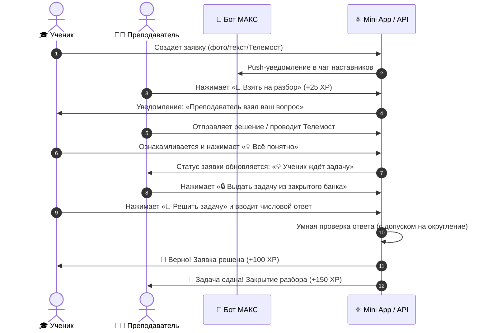

# ⚛️ ОГЭ Физика — Образовательная платформа взаимопомощи

<div align="center">


**Инновационный сервис дистанционного наставничества и подготовки к ОГЭ по физике (7–9 классы) с нативным Mini App в российском мессенджере МАКС.**

[Демонстрация и возможности](#-возможности-платформы) • [Полный цикл взаимопомощи](#-полный-цикл-взаимопомощи) • [Банк задач](#-банк-задач-и-база-знаний) • [Архитектура](#-архитектура-проекта) • [Запуск](#-быстрый-старт)

</div>

---

## 🌟 Возможности платформы

### 🎓 Кабинет обучающегося (Ученик)
- **Создание заявок:** Выбор класса (7, 8, 9), кодификатора темы ОГЭ, прикрепление фото задачи прямо с камеры или из галереи.
- **Два формата на выбор:**
  - 📝 **Письменный методический разбор:** Пошаговое решение с формулами, законами и чертежами.
  - 📹 **Индивидуальная видеоконсультация в Яндекс Телемосте:** Мгновенное подключение к звонку с наставником.
- **Диалог и закрепление:**
  - Возможность задать уточняющий вопрос (*«Что именно непонятно в формуле/шаге»*).
  - Подтверждение понимания темы кнопкой **«💡 Всё понятно, готов к задаче»**.
  - Решение контрольной задачи из Закрытого банка с автоматической проверкой ответа и начислением **+100 XP**.

### 👨‍🏫 Кабинет преподавателя (Наставник)
- **Лента открытых заявок:** Удобная доска заявок с фильтрами по классам (7, 8, 9), разделам физики (Механика, Теплота, Электродинамика, Квантовые) и частям ОГЭ.
- **Взятие в работу в 1 клик:** Кнопка **«🤝 Взять (+25 XP)»** с моментальным резервированием задачи.
- **Инструменты помощи:**
  - Текстовый редактор методического решения с прикреплением фото рукописного вычисления.
  - Создание и прикрепление комнаты Яндекс Телемост.
- **Выдача проверочной задачи:**
  - При подтверждении учеником понимания темы у преподавателя появляется кнопка **«🔒 Выдать задачу (+150 XP)»**.
  - Каталог Закрытого банка задач с сортировкой по сложности и темам для предотвращения списывания.
  - Автоматическое завершение заявки и начисление квалификационных баллов (**+150 XP**) после успешного решения учеником.

---

## 🔄 Полный цикл взаимопомощи



---

## 📚 Банк задач и База знаний

В платформу интегрированы два ключевых источника учебных материалов:

1. **📖 База разобранных задач (А. В. Пёрышкин, 7–9 классы):**
   - Полные решения типовых школьных задач с подробными объяснениями и иллюстрациями.
   - Указание авторства и номеров задач из классического задачника.
   - Полноэкранный просмотр графиков и схем (Lightbox).

2. **📝 Экзаменационный банк ОГЭ (Е. Е. Камзеева, ФИПИ):**
   - **Открытый практикум:** Задания 1 и 2 частей ОГЭ для самостоятельной тренировки с автоматической проверкой ответа (+15 XP).
   - **Закрытый банк задач:** Уникальные проверочные задания без готовых решений в сети для объективного контроля знаний после консультации с наставником.
   - **Умная валидация ответов:** Распознавание точек и запятых (`19.8` и `19,8`), автоматический числовой допуск на округление ($\pm 0.15$), защита от ложных отклонений верных ответов.

---

## 🏆 Геймификация и система званий

| Уровень / Ранг | XP Ученика | Балл ОГЭ | Звание Преподавателя |
| :--- | :--- | :--- | :--- |
| **Новичок** | 0 – 249 XP | 3 (Порог сдачи) | Младший наставник |
| **Практик** | 250 – 599 XP | 4 (Уверенная 4) | Наставник ОГЭ |
| **Мастер** | 600 – 999 XP | 5 (Отличник) | Старший эксперт |
| **Легенда** | 1000+ XP | 5+ (Максимум) | Заслуженный тьютор |

---

## 🏗 Архитектура проекта

```text
├── app/                        # FastAPI Backend
│   ├── api/                    # REST API эндпоинты (/tasks, /users, /bank, etc.)
│   ├── core/                   # Конфигурация Pydantic Settings, движок SQLAlchemy
│   ├── crud/                   # Слой доступа к данным (CRUDTask, CRUDUser, CRUDBankTask)
│   ├── models/                 # Модели данных (User, Task, Topic, Homework, BankTask, XP)
│   ├── schemas/                # Схемы валидации Pydantic v2
│   └── services/               # Уведомления MAX/Telegram, сервис геймификации
│
├── blobs-front/                # Vue 3 SPA / MAX Mini App
│   ├── src/
│   │   ├── components/         # RequestCard, BaseButton, BaseChip, ToastContainer
│   │   ├── views/              # StudentHome, TeacherDashboard, TeacherFeed, BankView, Profile
│   │   ├── stores/             # Хранилища Pinia (auth, toast)
│   │   ├── services/           # Централизованный API клиент и MAX Bridge
│   │   └── styles/             # Система дизайн-токенов tokens.css (Glassmorphism)
│   ├── package.json            # Зависимости интерфейса
│   └── vite.config.js          # Конфигурация сборщика Vite
│
├── bot_max.py                  # Бот российского мессенджера МАКС (MAX Bot API)
├── main.py                     # Главная точка входа backend-сервера
│
├── deploy/                     # Скрипты развертывания на production-сервер
│   ├── oge-web.service         # Systemd unit для бэкенда и SPA
│   ├── oge-bot.service         # Systemd unit для бота МАКС
│   ├── nginx.conf              # Конфигурация обратного прокси Nginx
│   └── deploy.sh               # Автоматический скрипт сборки и деплоя
│
├── docs/                       # Техническая документация
│   ├── TZ.md                   # Техническое задание проекта
│   ├── TZ_DATABASE.md          # Спецификация схемы базы данных
│   └── FRONTEND_CHAT_SPEC.md   # Спецификация UI/UX Mini App
│
├── scripts/                    # Скрипты инициализации и миграций
│   ├── seed_oge_topics.py      # Наполнение кодификатора тем ОГЭ (7-9 классы)
│   ├── seed_bank_tasks.py      # Наполнение открытого и закрытого банков задач
│   └── seed_peryshkin_solved_tasks.py # Наполнение разобранных задач Пёрышкина
│
├── Dockerfile                  # Многоэтапный Dockerfile
├── docker-compose.yml          # Стек Docker Compose
└── requirements.txt            # Python зависимости
```

---

## 🚀 Быстрый старт

### 1. Клонирование репозитория
```bash
git clone https://github.com/Cofemountain/help_student_gubkin.git
cd help_student_gubkin
```

### 2. Настройка переменных окружения
Скопируйте пример файла конфигурации:
```bash
cp .env.example .env
```
Заполните параметры:
- `MAX_BOT_TOKEN` — токен бота из кабинета разработчика МАКС (`dev.max.ru`).
- `DATABASE_URL` — `sqlite+aiosqlite:///oge_physics.db` (или PostgreSQL).
- `SECRET_KEY` — секретный ключ сессии.

### 3. Запуск Backend
```bash
python -m venv venv
source venv/bin/activate  # На Windows: .\venv\Scripts\activate
pip install -r requirements.txt
python main.py
```
Сервер запустится по адресу: `http://localhost:8000`. Документация Swagger доступна на `http://localhost:8000/docs`.

### 4. Запуск Frontend
```bash
cd blobs-front
npm install
npm run dev
```

### 5. Запуск бота МАКС
```bash
python bot_max.py
```

---

## 🛠 Технологический стек

- **Backend:** Python 3.12+, FastAPI, SQLAlchemy 2.0 (AsyncIO), Pydantic v2, Aiosqlite, Uvicorn.
- **Frontend:** Vue 3 (Composition API, `<script setup>`), Vite 8, Pinia, Vanilla CSS (Design Tokens, Glassmorphism, Responsive Mobile First).
- **Интеграции:** Российский мессенджер МАКС (`platform-api2.max.ru`), Яндекс Телемост.
- **Инфраструктура:** Nginx Reverse Proxy, Systemd Services, SSL / Let's Encrypt, Docker & Docker Compose.

---

<div align="center">
Разработано для всероссийского хакатона МАКС 2026.
</div>
