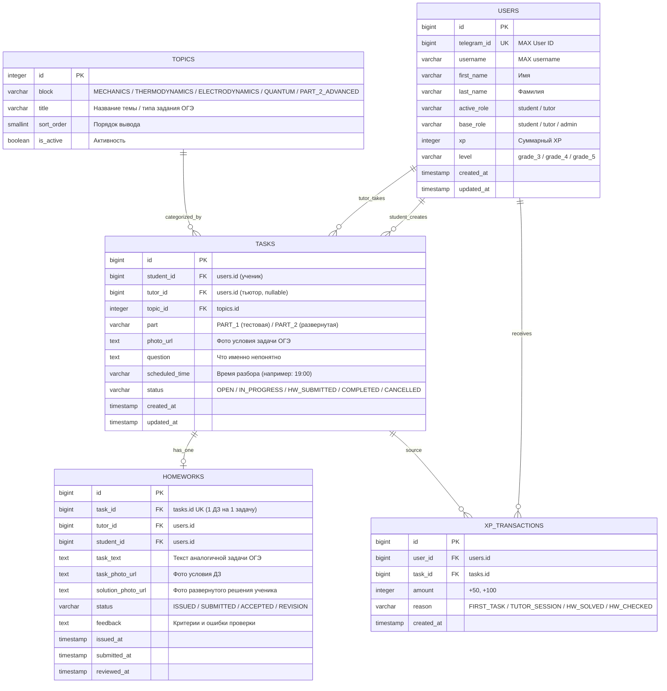

# ТЕХНИЧЕСКОЕ ЗАДАНИЕ ДЛЯ РОЛИ: РАЗРАБОТЧИК БАЗЫ ДАННЫХ И BACKEND DATA
## Проект: Платформа взаимопомощи по физике — 9 класс (Подготовка к ОГЭ)

> **Стек:** Python 3.11+, FastAPI, PostgreSQL 15+, SQLAlchemy 2.0 (async), Alembic, Pydantic v2  
> **Файл документа:** `TZ_DATABASE.md`  
> **Базовое ТЗ проекта:** [TZ_idea.md](file:///c:/Users/Admin/Desktop/%D0%B1%D0%BE%D1%82/TZ_idea.md)

---

## 1. ЦЕЛЬ И ЗОНА ОТВЕТСТВЕННОСТИ

Разработчик БД отвечает за:
1. Проектирование нормализованной реляционной схемы данных в **PostgreSQL**, сфокусированной на **подготовке к ОГЭ по физике за 9 класс**.
2. Реализацию асинхронных моделей на **SQLAlchemy 2.0 (asyncpg)**.
3. Организацию миграций схемы с помощью **Alembic**.
4. Обеспечение целостности, индексов быстродействия и идемпотентности транзакций (включая начисление XP).
5. Создание SQL-сида с кодификатором тем и разделов ОГЭ по физике (ФИПИ, 9 класс).
6. Реализацию репозиториев (CRUD) и логики разграничения прав доступа (RBAC).

---

## 2. РОЛЕВАЯ МОДЕЛЬ И ПРАВА ДОСТУПА (RBAC)

### 2.1. Роли пользователей
1. **`student` (Ученик 9 класса):**
   - Публикует задачи ОГЭ с фото условия и указанием темы/части (Часть 1 или 2);
   - Отслеживает статус своих заявок;
   - Сдает фото решения ДЗ формата ОГЭ;
   - Зарабатывает XP и повышает свой ранг от «Порога сдачи (3)» до «Отличника ОГЭ (5)».
2. **`tutor` (Тьютор / Наставник / Преподаватель):**
   - Просматривает общую доску открытых задач ОГЭ (`OPEN`), фильтрует по блокам;
   - Принимает задачу в работу (переводит в `IN_PROGRESS`);
   - Назначает время созвона/разбора;
   - Выдает ДЗ (прототип из ОГЭ);
   - Проверяет оформление решения по критериям ОГЭ (принимает либо отправляет на доработку);
   - Получает очки XP за наставничество.
3. **`admin` (Администратор):**
   - Полный доступ, модерация тем, ручная смена статусов.

> **Режимы в WebApp:**  
> Пользователь может переключаться между экранами *«Я сдаю ОГЭ»* и *«Я тьютор»*.  
> В таблице `users` хранятся:
> - `base_role` (`student` | `tutor` | `admin`) — базовая роль учетной записи;
> - `active_role` (`student` | `tutor`) — активный режим отображения в Mini App.

### 2.2. Матрица разрешений операций

| Действие / Эндпоинт | Статус задачи | `student` | `tutor` | `admin` | Условие проверки прав |
| :--- | :--- | :---: | :---: | :---: | :--- |
| `GET /api/topics` | Любой | ✅ | ✅ | ✅ | Доступно всем |
| `POST /api/tasks` | — | ✅ | ❌ | ✅ | Только в режиме `student` |
| `GET /api/tasks` (свободные ОГЭ) | `OPEN` | ❌ | ✅ | ✅ | Ученик видит только **свои** задачи |
| `GET /api/tasks/my` | Любой | ✅ | ✅ | ✅ | Свои созданные / взятые задачи |
| `POST /api/tasks/{id}/accept` | `OPEN` $\rightarrow$ `IN_PROGRESS` | ❌ | ✅ | ✅ | Нельзя взять свою же задачу (`student_id != user.id`) |
| `POST /api/tasks/{id}/homework` | `IN_PROGRESS` | ❌ | ✅ | ✅ | Только назначенный тьютор (`tutor_id == user.id`) |
| `POST /api/homework/{id}/submit`| `IN_PROGRESS` $\rightarrow$ `HW_SUBMITTED` | ✅ | ❌ | ✅ | Только автор задачи (`student_id == user.id`) |
| `POST /api/homework/{id}/review`| `HW_SUBMITTED` | ❌ | ✅ | ✅ | Только назначенный тьютор (`tutor_id == user.id`) |

---

## 3. СХЕМА БАЗЫ ДАННЫХ (ER-ДИАГРАММА)



---

## 4. ОПИСАНИЕ ТАБЛИЦ И СТРУКТУРЫ ПОЛЕЙ

### 4.1. Таблица `users` (Профиль участника подготовки к ОГЭ)

| Поле | Тип | Nullable | Описание / Индекс |
| :--- | :--- | :---: | :--- |
| `id` | `BIGSERIAL` | ❌ | PK |
| `telegram_id` | `BIGINT` | ❌ | `UNIQUE INDEX`, ID пользователя в мессенджере МАКС |
| `username` | `VARCHAR(64)` | ✅ | Никнейм без `@` |
| `first_name` | `VARCHAR(128)` | ❌ | Имя |
| `last_name` | `VARCHAR(128)` | ✅ | Фамилия |
| `active_role` | `VARCHAR(16)` | ❌ | Текущая вкладка в WebApp (`student`, `tutor`), default: `student` |
| `base_role` | `VARCHAR(16)` | ❌ | Основная роль (`student`, `tutor`, `admin`), default: `student` |
| `xp` | `INTEGER` | ❌ | Баланс XP, default: `0` |
| `level` | `VARCHAR(32)` | ❌ | Ранг ОГЭ (`grade_3`, `grade_4`, `grade_5`), default: `'grade_3'` |
| `created_at` | `TIMESTAMPTZ` | ❌ | Дата регистрации (`now()`) |
| `updated_at` | `TIMESTAMPTZ` | ❌ | Дата обновления (`now()`) |

---

### 4.2. Таблица `topics` (Кодификатор ОГЭ по физике за 9 класс)

| Поле | Тип | Nullable | Описание / Индекс |
| :--- | :--- | :---: | :--- |
| `id` | `SERIAL` | ❌ | PK |
| `block` | `VARCHAR(32)` | ❌ | Раздел ОГЭ: `MECHANICS`, `THERMODYNAMICS`, `ELECTRODYNAMICS`, `QUANTUM`, `PART_2_ADVANCED` (`INDEX`) |
| `title` | `VARCHAR(255)` | ❌ | Название темы |
| `sort_order` | `SMALLINT` | ❌ | Порядок в UI, default: `0` |
| `is_active` | `BOOLEAN` | ❌ | Флаг доступности темы, default: `TRUE` |

---

### 4.3. Таблица `tasks` (Заявки на разбор задач ОГЭ)

| Поле | Тип | Nullable | Описание / Индекс |
| :--- | :--- | :---: | :--- |
| `id` | `BIGSERIAL` | ❌ | PK |
| `student_id` | `BIGINT` | ❌ | FK $\rightarrow$ `users.id` (`INDEX`) |
| `tutor_id` | `BIGINT` | ✅ | FK $\rightarrow$ `users.id` (`INDEX`) |
| `topic_id` | `INTEGER` | ❌ | FK $\rightarrow$ `topics.id` (`INDEX`) |
| `part` | `VARCHAR(16)` | ❌ | Часть ОГЭ: `'PART_1'` (тест/база) или `'PART_2'` (сложная с развернутым ответом), default: `'PART_1'` |
| `photo_url` | `TEXT` | ❌ | Ссылка на фото условия задачи |
| `question` | `TEXT` | ❌ | Вопрос ученика: «В чем затык / что не понятно» |
| `scheduled_time`| `VARCHAR(64)` | ❌ | Желаемое время разбора (например, «Сегодня в 19:00») |
| `status` | `VARCHAR(20)` | ❌ | Статус (`INDEX`): `OPEN`, `IN_PROGRESS`, `HW_SUBMITTED`, `COMPLETED`, `CANCELLED` |
| `created_at` | `TIMESTAMPTZ` | ❌ | Дата публикации |
| `updated_at` | `TIMESTAMPTZ` | ❌ | Дата обновления |

---

### 4.4. Таблица `homeworks` (Контрольное ДЗ формата ОГЭ)

| Поле | Тип | Nullable | Описание / Индекс |
| :--- | :--- | :---: | :--- |
| `id` | `BIGSERIAL` | ❌ | PK |
| `task_id` | `BIGINT` | ❌ | FK $\rightarrow$ `tasks.id` (`UNIQUE INDEX`) |
| `tutor_id` | `BIGINT` | ❌ | FK $\rightarrow$ `users.id` |
| `student_id` | `BIGINT` | ❌ | FK $\rightarrow$ `users.id` |
| `task_text` | `TEXT` | ❌ | Условие задачи для ДЗ |
| `task_photo_url`| `TEXT` | ✅ | Фото условия аналогичного задания ОГЭ |
| `solution_photo_url` | `TEXT` | ✅ | Фото рукописного решения ученика |
| `status` | `VARCHAR(20)` | ❌ | `ISSUED`, `SUBMITTED`, `ACCEPTED`, `REVISION` |
| `feedback` | `TEXT` | ✅ | Разбор ошибок по критериям ФИПИ |
| `issued_at` | `TIMESTAMPTZ` | ❌ | Время выдачи |
| `submitted_at` | `TIMESTAMPTZ` | ✅ | Время сдачи решения |
| `reviewed_at` | `TIMESTAMPTZ` | ✅ | Время проверки |

---

### 4.5. Таблица `xp_transactions` (Аудит баллов и прогресса ОГЭ)

| Поле | Тип | Nullable | Описание |
| :--- | :--- | :---: | :--- |
| `id` | `BIGSERIAL` | ❌ | PK |
| `user_id` | `BIGINT` | ❌ | FK $\rightarrow$ `users.id` (`INDEX`) |
| `task_id` | `BIGINT` | ✅ | FK $\rightarrow$ `tasks.id` |
| `amount` | `INTEGER` | ❌ | Величина (+50, +100) |
| `reason` | `VARCHAR(32)` | ❌ | `FIRST_TASK`, `TUTOR_SESSION`, `HW_SOLVED`, `HW_CHECKED` |
| `created_at` | `TIMESTAMPTZ` | ❌ | Время начисления |

> **Защита от дублей:** `CREATE UNIQUE INDEX uq_user_task_reason ON xp_transactions (user_id, task_id, reason);`

---

## 5. ЛОГИКА ГЕЙМИФИКАЦИИ И ШКАЛА ОГЭ

### 5.1. Правила начисления XP
- **+50 XP** — ученику за публикацию первой задачи ОГЭ;
- **+100 XP** — тьютору за завершенный разбор задачи ОГЭ;
- **+100 XP** — ученику за принятое ДЗ формата ОГЭ;
- **+50 XP** — тьютору за проверку решения с комментариями по критериям ФИПИ.

### 5.2. Шкала уровней ОГЭ (9 класс)
Функция пересчета уровня вызывается в транзакции изменения `xp`:
- **🥉 0 – 200 XP:** `grade_3` — **«Порог сдачи (Оценка 3)»** (освоение базовых определений и формул)
- **🥈 201 – 600 XP:** `grade_4` — **«Уверенная 4-ка (Оценка 4)»** (уверенное решение тестовой части и базовых расчетных задач)
- **🥇 600+ XP:** `grade_5` — **«Отличник ОГЭ (Оценка 5)»** (решение качественных и сложных расчетных задач №20–25)

---

## 6. ГОТОВЫЙ SQL-СИД: ТЕМЫ ОГЭ ПО ФИЗИКЕ (9 КЛАСС)

Все 17 актуальных тем кодификатора ОГЭ, сгруппированные по 5 разделам:

```sql
INSERT INTO topics (block, sort_order, title, is_active) VALUES
-- РАЗДЕЛ 1: МЕХАНИЧЕСКИЕ ЯВЛЕНИЯ
('MECHANICS', 1, 'Равноускоренное движение, ускорение, графики движения', true),
('MECHANICS', 2, 'Законы Ньютона, силы тяжести, упругости, трения', true),
('MECHANICS', 3, 'Закон сохранения импульса и энергии, работа и мощность', true),
('MECHANICS', 4, 'Статика: условия равновесия рычага, КПД простых механизмов', true),
('MECHANICS', 5, 'Давление в жидкостях и газах, сила Архимеда, плавание тел', true),
('MECHANICS', 6, 'Механические колебания и волны, звук', true),

-- РАЗДЕЛ 2: ТЕПЛОВЫЕ ЯВЛЕНИЯ
('THERMODYNAMICS', 7, 'Теплопередача, количество теплоты, удельная теплоемкость', true),
('THERMODYNAMICS', 8, 'Фазовые переходы: плавление, кипение, влажность воздуха', true),
('THERMODYNAMICS', 9, 'Уравнение теплового баланса и КПД тепловых двигателей', true),

-- РАЗДЕЛ 3: ЭЛЕКТРОМАГНИТНЫЕ ЯВЛЕНИЯ
('ELECTRODYNAMICS', 10, 'Электрические цепи: последовательное и параллельное соединение, Закон Ома', true),
('ELECTRODYNAMICS', 11, 'Работа и мощность тока, Закон Джоуля-Ленца', true),
('ELECTRODYNAMICS', 12, 'Магнитное поле, электромагнитная индукция, опыты Фарадея', true),
('ELECTRODYNAMICS', 13, 'Геометрическая оптика: отражение, преломление, построение в линзах', true),

-- РАЗДЕЛ 4: КВАНТОВЫЕ ЯВЛЕНИЯ
('QUANTUM', 14, 'Строение атома и атомного ядра, изотопы', true),
('QUANTUM', 15, 'Радиоактивность: альфа, бета, гамма-излучения, ядерные реакции', true),

-- РАЗДЕЛ 5: ВТОРАЯ ЧАСТЬ ОГЭ (ПОВЫШЕННАЯ СЛОЖНОСТЬ)
('PART_2_ADVANCED', 16, 'Качественные задачи с подробным объяснением (№20–22 ОГЭ)', true),
('PART_2_ADVANCED', 17, 'Расчетные комбинированные задачи 2-й части (№23–25 ОГЭ)', true)
ON CONFLICT DO NOTHING;
```

---

## 7. НЕОБХОДИМЫЕ ИНДЕКСЫ В БАЗЕ ДАННЫХ

```sql
-- Быстрый поиск пользователя по ID в МАКС при каждом входе в WebApp
CREATE UNIQUE INDEX idx_users_telegram_id ON users (telegram_id);

-- Быстрая фильтрация задач на доске (по статусу, разделу ОГЭ и части)
CREATE INDEX idx_tasks_status_part ON tasks (status, part);
CREATE INDEX idx_tasks_topic_id ON tasks (topic_id);
CREATE INDEX idx_topics_block ON topics (block);

-- Быстрый доступ к моим задачам ученика / тьютора
CREATE INDEX idx_tasks_student_id ON tasks (student_id);
CREATE INDEX idx_tasks_tutor_id ON tasks (tutor_id);

-- Связь 1 к 1 задачи и домашнего задания
CREATE UNIQUE INDEX idx_homeworks_task_id ON homeworks (task_id);

-- Защита от двойного начисления XP
CREATE UNIQUE INDEX uq_user_task_reason ON xp_transactions (user_id, task_id, reason);
```

---

## 8. АРХИТЕКТУРА И СТРУКТУРА ПАПОК ДЛЯ РЕАЛИЗАЦИИ

```
backend/
├── alembic/                    # Миграции структуры БД
│   ├── versions/
│   └── env.py
├── app/
│   ├── core/
│   │   ├── config.py           # Настройки (DATABASE_URL, BOT_TOKEN и др.)
│   │   └── database.py         # AsyncEngine, AsyncSessionLocal, Base
│   ├── models/                 # SQLAlchemy 2.0 декларативные модели
│   │   ├── __init__.py
│   │   ├── user.py             # User (модель с MAX User ID, XP и уровнем ОГЭ)
│   │   ├── topic.py            # Topic (кодификатор тем ОГЭ)
│   │   ├── task.py             # Task (заявка ОГЭ с Part 1/2)
│   │   ├── homework.py         # Homework (ДЗ и проверка по критериям)
│   │   └── xp_transaction.py   # XPTransaction
│   ├── schemas/                # Валидация Pydantic v2
│   │   ├── user.py
│   │   ├── topic.py
│   │   ├── task.py
│   │   └── homework.py
│   ├── crud/                   # CRUD-репозитории для изоляции запросов к БД
│   │   ├── crud_user.py
│   │   ├── crud_topic.py
│   │   ├── crud_task.py
│   │   └── crud_homework.py
│   ├── services/               # Бизнес-правила (расчет рангов ОГЭ 3/4/5, транзакции XP)
│   │   └── gamification.py
│   └── api/                    # Роутеры FastAPI
│       ├── deps.py             # get_db, get_current_user
│       └── v1/
│           ├── endpoints_tasks.py
│           ├── endpoints_topics.py
│           └── endpoints_homework.py
├── scripts/
│   └── seed_oge_topics.py      # Скрипт наполнения 17 тем ОГЭ
├── alembic.ini
├── requirements.txt
└── main.py
```
